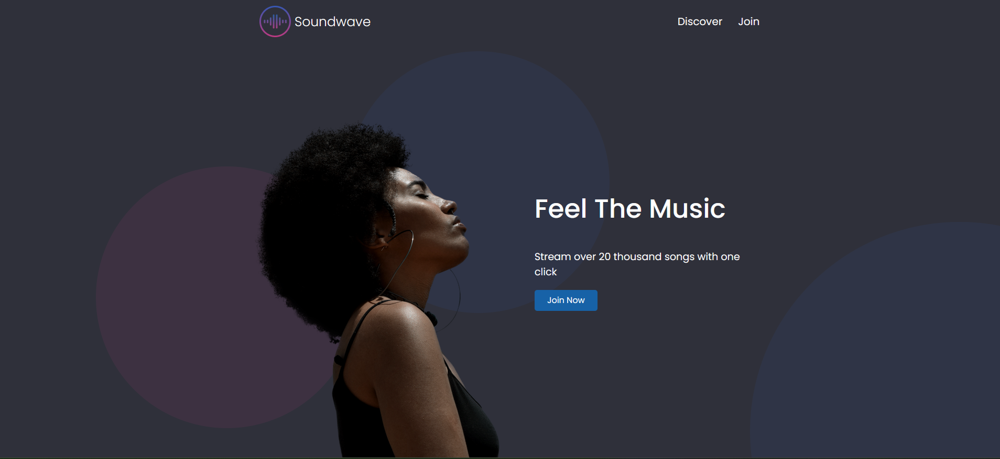
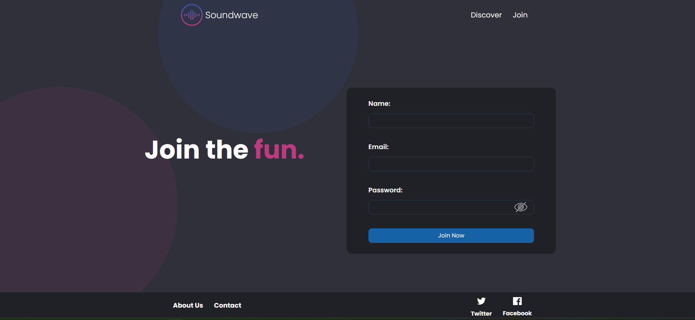

# 🎧 SoundWave

**SoundWave** is a modern **Single Page Application (SPA)** inspired by music streaming platforms like Spotify.  
It provides a clean, responsive user interface and a solid frontend architecture built with **React + Vite**, focused on performance, scalability, and developer experience.

---

## 🚀 Features

- ⚛️ Built with **React** and **Vite**
- 🎨 Modular and maintainable styling using **CSS Modules** and **CSS**
- 👤 User registration and data handling via **JSON Server**
- 🧪 Unit and component testing with **Vitest**
- ⚡ Fast development environment and optimized build
- 📱 Responsive design (mobile-first)

---

## 🛠️ Tech Stack

### Frontend
- **React**
- **Vite**
- **JavaScript (ES6+)**
- **CSS Modules**
- **CSS**
- **TailWind**

### Backend / Mock API
- **JSON Server**

### Testing
- **Vitest**

### Tooling
- **Node.js**
- **npm**

### Another Tools for the project
- **[Trello](https://trello.com/b/rX15mBQi/sound-wave)**
- **[Flowchart](https://drive.google.com/file/d/1i4zTkp52HiTL043L-j9Aja2GK4HWybhV/view?usp=sharing)**
---

## 📦 Installation

Follow these steps to run the project locally:

1. **Clone the repository**
   ```bash
   git clone https://github.com/Jennyx-1984/sound-wave


2. **Navigate to the project directory**
cd sound-wave

3. **Install dependencies**
npm install

4. **Start the JSON Server**
npx json-server db.json

5. **Run the development server**
npm run dev

6. **Open your browser and go to:**
http://localhost:5173/


## 🧪 Running Tests
1. **To run the test suite using Vitest:**
npm run test

2. **To see the coverage:**
npx vitest run --coverage

## 📁 Project Structure (Simplified)
soundwave/
├── src/
│   ├── components/
|   |    |__atomic/
|   |    |   |__ Button.jsx
|   |    |   |__ButtonDiscover.jsx
|   |    |   |__Circle.jsx    
|   |    |__helpers/
|   |    |    |__createData.jsx
|   |    |    |__helpCrud.jsx
|   |    |__Footer.jsx
|   |    |__Form.jsx
|   |    |__Header.jsx
|   |    |__Loading.jsx
│   ├── pages/
|   |    |__construction.jsx
|   |    |__discover.jsx
|   |    |__join.jsx
|   |    |__presentacion.jsx
|   |    |__submit.jsx
│   ├── services/
|   |    |__userService.js
│   ├── css/
|   |    |__buttondiscover.module.css
|   |    |__buttonJoin.css
|   |    |__buttonNav.css
|   |    |__circle.css
|   |    |__construction.module.css
|   |    |__discover.module.css
|   |    |__footer.module.css
|   |    |__form.module.css
|   |    |__header.css
|   |    |__join.module.css
|   |    |__loading.css
|   |    |__mainlayout.module.css
|   |    |__presentacion.css
|   |    |__submit.module.css
|   |__ tests/
|   |    |__ app.test.jsx
|   |    |__ button.test.jsx
|   |    |__ buttonDiscover.test.jsx
|   |    |__ circle.test.jsx
|   |    |__ construction.test.jsx
|   |    |__ createData.test.jsx
|   |    |__ discover.test.jsx
|   |    |__ errorForm.test.jsx
|   |    |__ footer.test.jsx
|   |    |__ form.test.jsx
|   |    |__ header.test.jsx
|   |    |__ helpCrud.test.jsx
|   |    |__ join.test.jsx
|   |    |__ layout.test.jsx
|   |    |__ loading.test.jsx
|   |    |__ presentacion.test.jsx
|   |    |__ submit.test.jsx
|   |    |__ validationForm.test.jsx
│   ├── App.jsx
│   └── main.jsx
|   |__ App.css
|   |__ index.css
|   |__ setupTests.ts
├── public/
├── db.json
├── package.json
└── vite.config.js
└── .gitignore
└── package-lock.json
└── README.md
└── tailwind.config.ts
└── vite.config.js
└── vitest.config.js
└── vitest.setup.js
└── esling.config.js
└── index.html


## 📌 Current Status
✅ Functional
The application is fully working and stable, with room for future improvements and new features.

## 🔮 Possible Future Improvements

🔐 Authentication & authorization

🎵 Real music streaming API integration

❤️ Favorites & playlists system

🌙 Dark / Light theme toggle

🧠 Global state management (Redux / Zustand)

🚀 Performance optimizations and lazy loading


## 🤝 Contributing

Contributions are welcome!

Fork the repository

Create a new branch (feature/new-feature)

Commit your changes

Open a Pull Request


## 📄 License

This project is for educational and personal use.
You are free to modify and adapt it.


## ⭐ Acknowledgements

Inspired by modern music streaming platforms and built with a passion for clean UI and scalable frontend architecture.

If you like this project, feel free to give it a ⭐ on GitHub!

## Screenshots




## AUTHOR ##
Jennifer Cros Bañuelos


